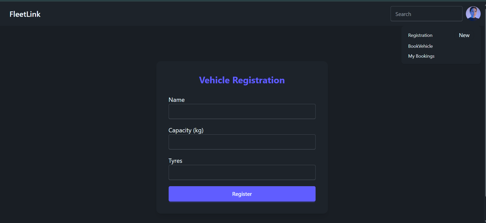
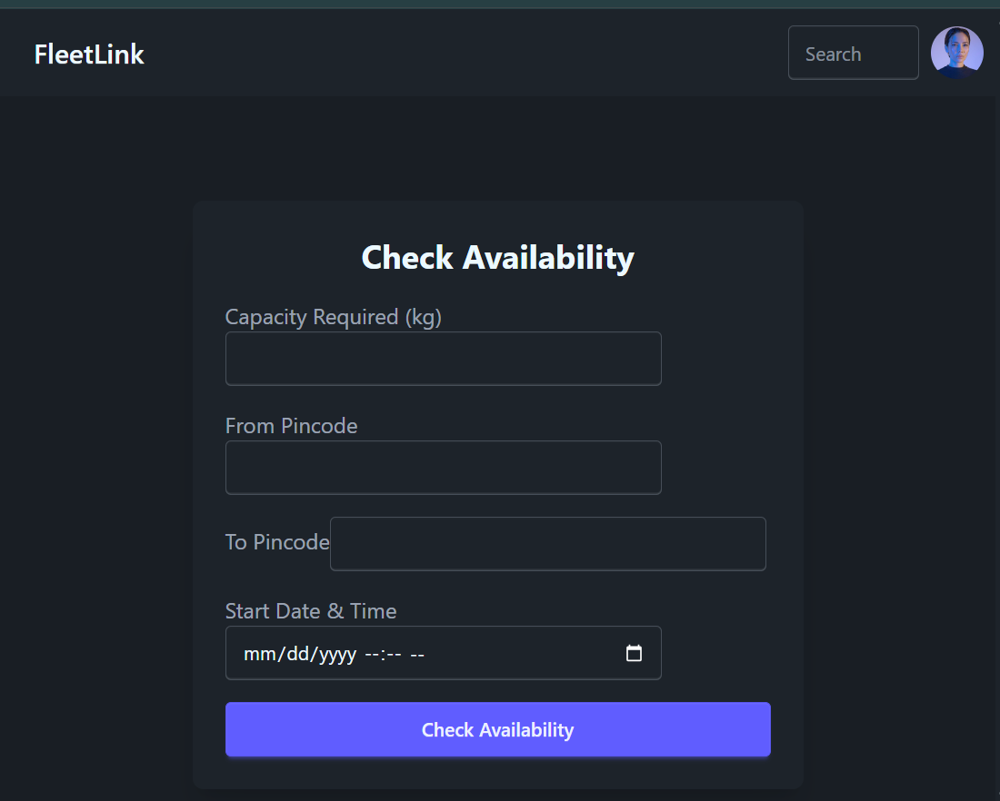
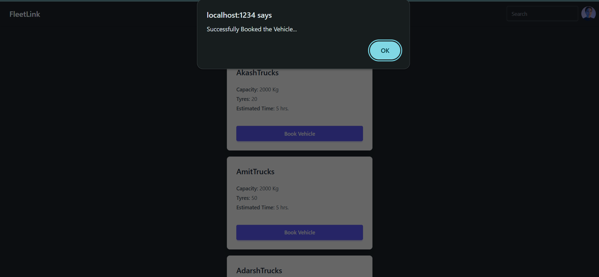
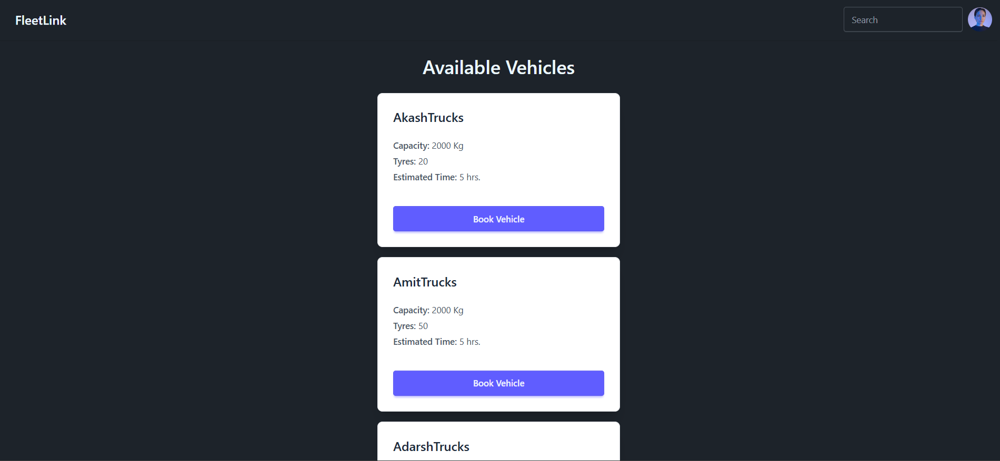
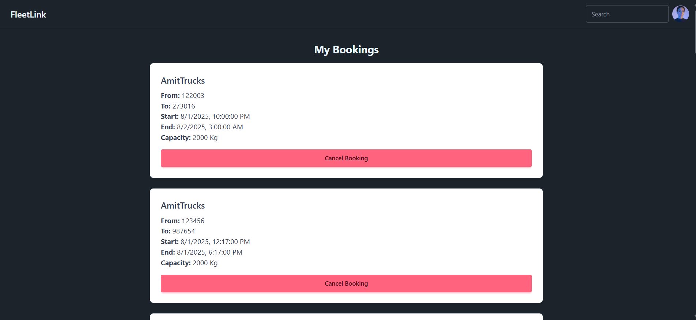

# FleetLink
FleetLink - Logistics Vehicle Booking System

Openproject in VS code

How to start Project..
1st step
open terminal
#cd frontend
#npm install
#npm run dev

2nd step
open onother terminal
#cd backend
#npm install
#npm run dev

then you can see on localhost:1234